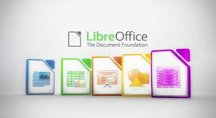

# CSMA3050



# LibreOffice

**LibreOffice** is a free and open-source office suite that offers a comprehensive set of tools for word processing, spreadsheets, presentations, and more. It is an alternative to commercial office software and supports a variety of file formats, including those used by Microsoft Office (.docx, .xlsx, .pptx), as well as its own Open Document Format (ODF).

---

## LibreOffice Applications

- **[Writer](https://www.libreoffice.org/discover/writer/)** – A powerful word processor.
- **[Calc](https://www.libreoffice.org/discover/calc/)** – A feature-rich spreadsheet program.
- **[Impress](https://www.libreoffice.org/discover/impress/)** – A presentation software.
- **[Draw](https://www.libreoffice.org/discover/draw/)** – A tool for creating vector graphics.
- **[Base](https://www.libreoffice.org/discover/base/)** – A database management system.
- **[Math](https://www.libreoffice.org/discover/math/)** – A formula editor for creating mathematical equations.

---

## Installation

### Windows:
1. Download the installer from the [official LibreOffice website](https://www.libreoffice.org/download/download/).
2. Run the installer and follow the on-screen instructions.

### macOS:
1. Download the macOS version of LibreOffice from the [official site](https://www.libreoffice.org/download/download/).
2. Open the downloaded file and move the LibreOffice application to your Applications folder.

### Linux:
1. Install LibreOffice through your package manager by running the following command in the terminal:
   ```bash
   sudo apt install libreoffice

Install LibreOffice through your package manager, for example, by running the following command in the terminal:
bash
Copy code
sudo apt install libreoffice
You can also download the latest version directly from the official LibreOffice website.
Key Features
1. Writer – Word Processor
LibreOffice Writer provides a complete set of tools for writing and editing documents. You can create everything from simple letters to complex books. It supports multiple file formats, including .docx, .odt, and .pdf.

Example:

Key Feature: The automatic spell check, customizable templates, and styles help you easily create well-formatted documents.
2. Calc – Spreadsheet Software
LibreOffice Calc is a powerful tool for organizing and analyzing data in spreadsheets. It is compatible with Microsoft Excel file formats and offers advanced features such as pivot tables, charts, and complex formulas.

Example:

Key Feature: Calc includes powerful functions for statistical analysis, and supports data visualization with a variety of chart types.
Getting Started
Creating a Document:

Open LibreOffice Writer and click on "File > New > Text Document."
Start typing your content and use the toolbar to format text, insert images, and create tables.
Saving and Exporting:

LibreOffice allows saving in multiple formats, such as .docx, .odt, .pdf, and others.
To export your document, click on "File > Export As" and select the desired format.
Support and Contribution
For any issues or support, visit the official LibreOffice Help Center. If you'd like to contribute to the development, you can join the LibreOffice development community or check their GitHub repository.

For updates, further information, or to download LibreOffice, visit the official LibreOffice website.
